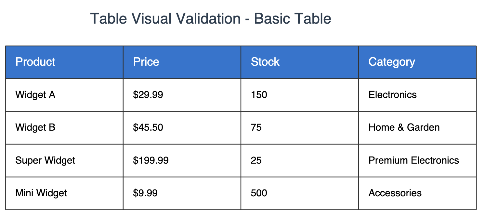
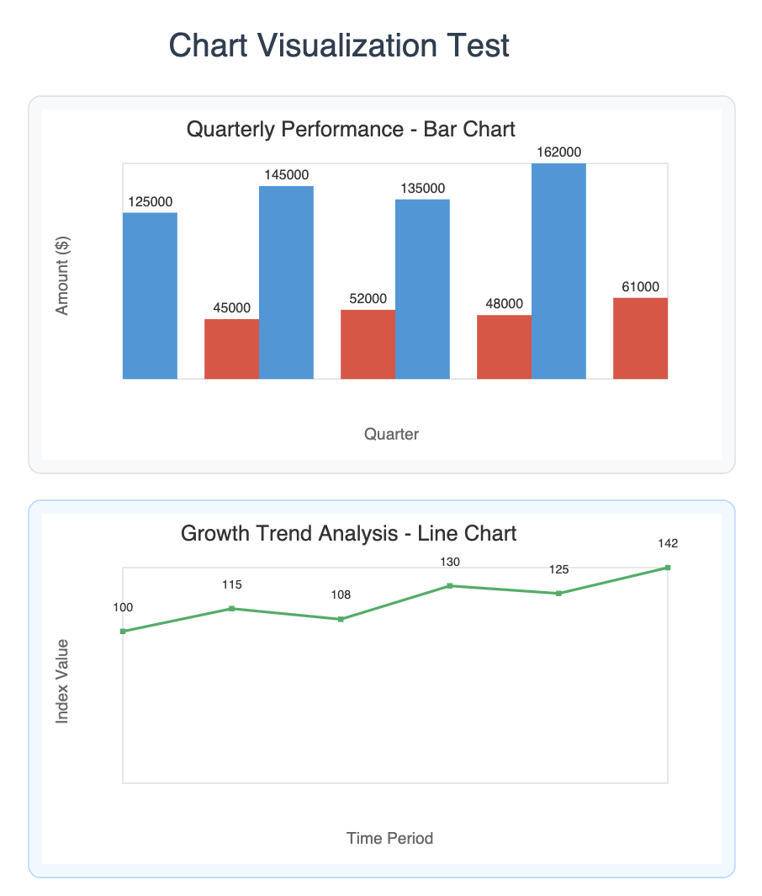
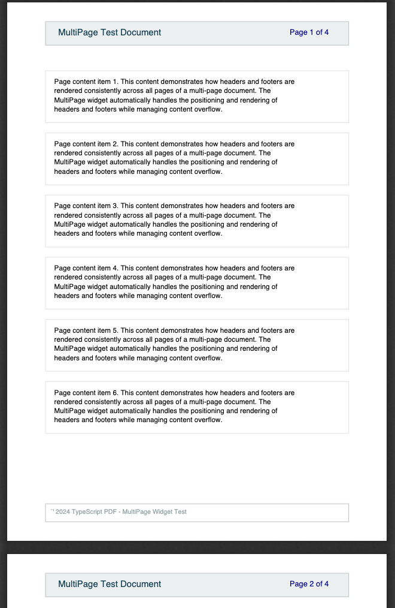

# typescript-pdf

[](https://www.npmjs.com/package/typescript-pdf)
[](https://github.com/nick-we/typescript-pdf/actions)
[](https://github.com/nick-we/typescript-pdf/actions)
[](https://github.com/nick-we/typescript-pdf)
[](https://opensource.org/licenses/MIT)

A TypeScript library for programmatic PDF generation with a declarative, widget-based API inspired by Flutter. Build complex PDF documents with type safety.

## 🎯 Production Ready

**typescript-pdf v0.5.0** represents a mature PDF generation library:

- ✅ **100% Test Coverage** - 267/267 tests passing
- ✅ **Production Stability** - Comprehensive error handling and edge case coverage
- ✅ **Advanced Features** - MultiPage documents, table text overflow, data visualization
- ✅ **Cross-Platform** - Universal Node.js and browser compatibility

## 🚀 Key Features

### **Core Capabilities**
- **🔒 Type-Safe**: Complete TypeScript implementation
- **📱 Declarative API**: Widget-based approach similar to React/Flutter  
- **🌍 Universal**: Works seamlessly in Node.js and browsers
- **⚡ High Performance**: Optimized constraint-based layout engine with caching
- **📄 Multi-Page Support**: Automatic page breaks with headers and footers
- **📊 Data Visualization**: Built-in tables and charts with advanced styling

### **Advanced Widget System**
- **Layout Widgets**: Container, Padding, Margin, Align, Center, Stack, Positioned
- **Flex Layouts**: Row, Column, Flexible, Expanded with Flutter-style alignment
- **Text Rendering**: Rich text, font fallbacks, text overflow (clip/ellipsis/visible)
- **Data Tables**: Advanced tables with column layouts, borders, and text overflow
- **Charts & Graphs**: Bar charts, line charts with customizable styling
- **Theme System**: Comprehensive theming with style inheritance

## 📦 Installation

```bash
npm install typescript-pdf
# or
pnpm add typescript-pdf
# or  
yarn add typescript-pdf
```

## 🎬 Visual Examples

### Advanced Table System
Professional tables with borders, text overflow, and custom styling:



### Data Visualization
Built-in chart widgets for business reports and dashboards:



### Multi-Page Documents
Automatic page breaks with headers, footers, and consistent formatting:



## 🎯 Quick Start

### Simple Document

```typescript
import { writeFile } from 'fs/promises';
import { Document, TextWidget, Container, Layout } from 'typescript-pdf';

const doc = new Document();
doc.addPage({
    build: () => new Container({
        decoration: {
            color: '#f0f0f0ff',
            border: { width: 1, color: '#000000' },
            borderRadius: BorderRadiusUtils.circular(4),
        },
        padding: Layout.EdgeInsets.all(20),
        child: new TextWidget('Hello World!', {
            style: { fontSize: 24, color: '#1976d2' }
        })
    })
});

const pdfBytes = await doc.save();
console.log('PDF data has been generated.');

// Save the generated PDF data to a file named 'hello-world.pdf'.
await writeFile('hello-world.pdf', pdfBytes);
console.log('✅ Successfully saved PDF to hello-world.pdf');
```

### Business Report with Table

```typescript
import { Document, MultiPage, Table, TextWidget, Container, DataUtils, Theme } from 'typescript-pdf';

const doc = new Document();
doc.addPage({
  build: () => new MultiPage({
    header: (pageNum, total) => new TextWidget(`Page ${pageNum} of ${total}`),
    children: [
      new Container({
        child: new TextWidget('Q4 Financial Report', {
          style: { fontSize: 28, fontWeight: Theme.FontWeight.Bold }
        })
      }),
      new Table({
        data: [
          ['Product', 'Revenue', 'Growth'],
          ['Product A', '$1.2M', '+15%'],
          ['Product B', '$980K', '+8%'],
          ['Product C', '$750K', '+22%']
        ],
        columnWidths: [
            DataUtils.columnWidths.flex(1),
            DataUtils.columnWidths.flex(1),
            DataUtils.columnWidths.flex(1)
        ],
        borders: DataUtils.borders.all({ width: 1, color: '#333333' }),
        headerStyle: { fontSize: 14, fontWeight: Theme.FontWeight.Bold, color: '#ffffff' }
      })
    ]
  })
});

const pdfBytes = await doc.save();
```

### Data Visualization Dashboard

```typescript
import { Document, Column, BarChart, LineChart, DataUtils, LineMarker } from 'typescript-pdf';

const salesData = DataUtils.createSeries('Sales', [
  { x: 'Q1', y: 1200 },
  { x: 'Q2', y: 1450 },
  { x: 'Q3', y: 1100 },
  { x: 'Q4', y: 1680 }
]);

const doc = new Document();
doc.addPage({
  build: () => new Column({
    children: [
      new BarChart({
        title: 'Quarterly Sales Performance',
        series: [salesData],
        width: 400,
        height: 250
      }),
      new LineChart({
        title: 'Growth Trend',
        series: [salesData],
        width: 400,
        height: 200,
        marker: LineMarker.Circle
      })
    ]
  })
});

const pdfBytes = await doc.save();
```

## 🏗️ Architecture

**typescript-pdf** uses a sophisticated dual-layer architecture:

### **High-Level Widget System**
```
┌─────────────────────────────────────────────────────────────┐
│                    Declarative Widget API                   │
│  ┌─────────────┐ ┌─────────────┐ ┌─────────────┐          │
│  │   Layout    │ │    Data     │ │   Theme     │          │
│  │   Widgets   │ │ Visualization│ │   System    │          │
│  └─────────────┘ └─────────────┘ └─────────────┘          │
└─────────────────────────────────────────────────────────────┘
```

### **Low-Level PDF Engine**
```
┌─────────────────────────────────────────────────────────────┐
│                     PDF Generation Core                     │
│  ┌─────────────┐ ┌─────────────┐ ┌─────────────┐          │
│  │    Font     │ │  Graphics   │ │   Document  │          │
│  │   System    │ │   Context   │ │  Management │          │
│  └─────────────┘ └─────────────┘ └─────────────┘          │
└─────────────────────────────────────────────────────────────┘
```

### **Key Design Principles**
- **Composition over Inheritance**: Modular, composable widgets
- **Performance Optimized**: Constraint-based layout with intelligent caching
- **Developer Experience**: IntelliSense support and comprehensive error messages

## 📊 Widget Catalog

### **Layout & Positioning**
- `Container` - Box model container with padding, margin, decoration
- `Padding` - Add spacing inside widgets
- `Margin` - Add spacing outside widgets  
- `Align` - Position child widgets with precise alignment
- `Center` - Quick center alignment
- `Stack` - Layer widgets with z-index positioning
- `Positioned` - Absolute positioning within Stack

### **Flex Layout System**
- `Row` - Horizontal flex layout with alignment options
- `Column` - Vertical flex layout with distribution control
- `Flexible` - Responsive flex children
- `Expanded` - Fill available space in flex layouts

### **Text & Typography**
- `TextWidget` - Styled text rendering with font fallbacks
- `RichText` - Multi-span text with different styles
- Text overflow modes: Clip, Ellipsis, Visible
- Font system with intelligent fallbacks

### **Data & Visualization**
- `Table` - Advanced tables with column layouts and borders
- `TableRow` - Individual table rows with custom styling
- `BarChart` - Horizontal and vertical bar charts
- `LineChart` - Line graphs with markers and styling
- `Chart` - Base chart class for custom visualizations

### **Document Structure**
- `MultiPage` - Automatic page breaks with headers/footers
- `Theme` - Consistent styling across documents
- `DefaultTextStyle` - Cascading text style inheritance

## 📚 Documentation

### **Guides**
- [Getting Started](docs/getting-started.md)
- [Widget System](docs/widgets/index.md)
- [Table Guide](docs/table-guide.md)
- [Typography System](docs/typography.md)
- [Theming Guide](docs/theming-guide.md)

### **Examples**
- [Hello World](examples/hello-world.ts) - Basic document creation
- [Table Showcase](examples/table-showcase.ts) - Advanced table layouts
- [Chart Showcase](examples/chart-showcase.ts) - Data visualization examples
- [MultiPage Documents](examples/multipage-showcase.ts) - Multi-page with headers/footers
- [Theming Demo](examples/theming-showcase.ts) - Theme system examples

## 🛠️ Development

### **Modern Development Stack**
- **TypeScript 5.0+** with strict type checking (zero `any` types)
- **Vite** for lightning-fast development
- **Vitest** for testing with 100% coverage
- **ESLint + Prettier** for code quality
- **Rollup** for optimized production builds
- **pnpm** for efficient package management

### **Setup**

```bash
# Clone and setup
git clone https://github.com/nick-we/typescript-pdf.git
cd typescript-pdf
pnpm install

# Development
pnpm dev          # Start development server
pnpm test         # Run test suite (267/267 tests)
pnpm test:ui      # Visual test interface
pnpm build        # Production build
pnpm type-check   # TypeScript validation
```

### **Quality Metrics**
- ✅ **100% Test Coverage** - 267/267 tests passing
- ✅ **Zero TypeScript Errors** - Complete type safety
- ✅ **Perfect Code Quality** - ESLint + Prettier compliance
- ✅ **Production Ready** - Comprehensive error handling

## 📈 Project Status

**Current Phase**: Production Ready ✅

### **Completed Features**
- ✅ **Phase 1**: Foundation & TypeScript Setup
- ✅ **Phase 2**: Low-Level PDF Engine
- ✅ **Phase 3**: Widget System (15+ widgets)
- ✅ **Phase 4**: Advanced Features & Multi-Page Support
- ✅ **Phase 5**: Type Safety & Perfect Test Coverage

### **Roadmap - Next Phase**
- 🔄 **Image Support**: PNG, JPG, WebP, SVG widget implementation
- 🔄 **Form Elements**: Interactive PDF forms and input fields
- 🔄 **Plugin System**: Extensible architecture for third-party widgets
- 🔄 **Performance**: Large document optimization and streaming

## 🤝 Contributing

We welcome contributions! typescript-pdf has achieved production stability with comprehensive test coverage.

### **Development Workflow**
1. Fork the repository
2. Create feature branch: `git checkout -b feature/amazing-feature`
3. Make changes with tests: All changes must maintain 100% test coverage
4. Run validation: `pnpm test && pnpm type-check && pnpm lint`
5. Submit PR with detailed description

### **Contribution Guidelines**
- **Type Safety**: No `any` types allowed - maintain complete type safety
- **Test Coverage**: All new features must include comprehensive tests
- **Documentation**: Update relevant docs and examples
- **Performance**: Consider impact on layout and rendering performance

## 🎯 Use Cases

### **Business Applications**
- **Financial Reports**: Multi-page reports with tables and charts
- **Invoices & Receipts**: Professional document generation
- **Certificates**: Styled certificates with custom layouts
- **Analytics Dashboards**: Data visualization with charts and metrics

### **Integration Scenarios**
- **Web Applications**: Client-side PDF generation in browsers
- **Node.js APIs**: Server-side document generation services
- **React/Vue Apps**: Component-based PDF creation
- **Express.js Routes**: PDF endpoints for web applications
- **Automated Reporting**: Scheduled report generation systems

## 📄 License

This project is licensed under the MIT License - see the [LICENSE](LICENSE) file for details.

## 🙏 Acknowledgments

- **Inspiration**: [dart-pdf](https://github.com/DavBfr/dart_pdf) - The original Dart PDF library
- **Architecture**: Flutter widget system for declarative UI patterns  
- **Community**: TypeScript ecosystem and modern web development practices

## 📞 Support & Community

- 🐛 **Issues**: [GitHub Issues](https://github.com/nick-we/typescript-pdf/issues)
- 💬 **Discussions**: [GitHub Discussions](https://github.com/nick-we/typescript-pdf/discussions)
- 📖 **Documentation**: [API Reference](https://typescript-pdf.dev) *(Coming Soon)*
- 📧 **Maintainer**: [@nick-we](https://github.com/nick-we)

---

**Made by [Nick Westendorf](https://github.com/nick-we)**

*typescript-pdf v0.5.0 -PDF Generation for TypeScript*